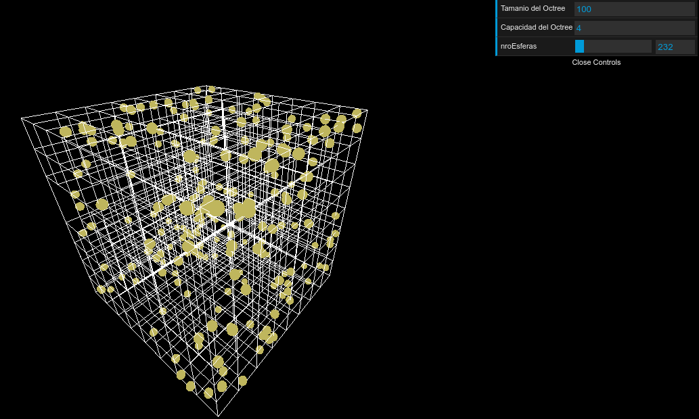
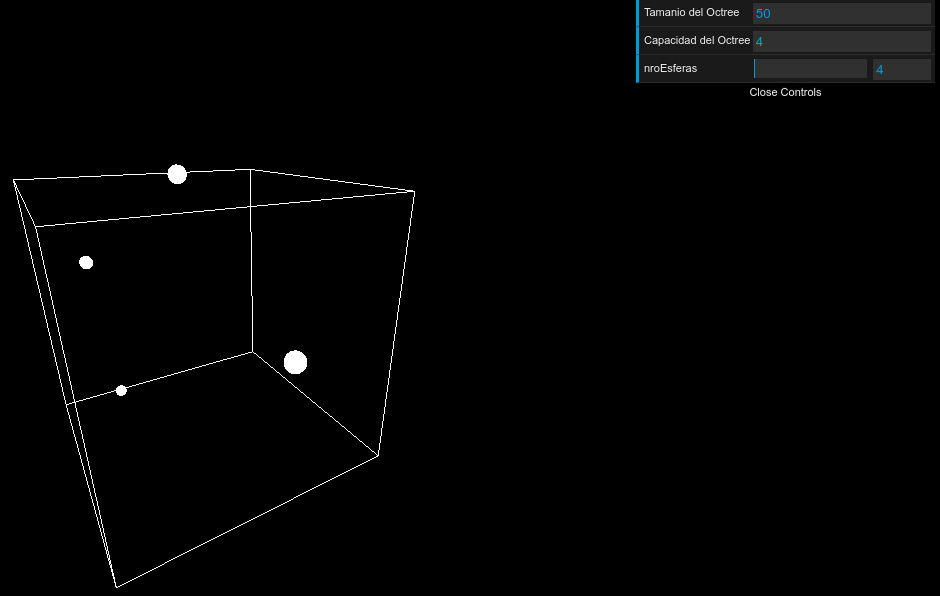
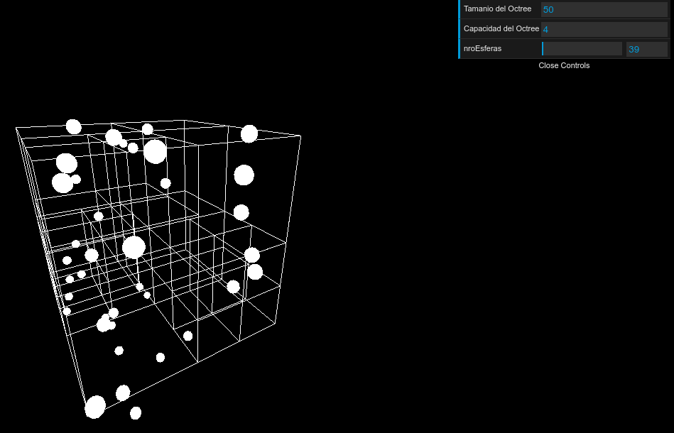

#  Colisionador de particulas usando three.js

Queria reflejas los que en el quadtree se lograba realizar con las colisiones y filtrar las consultas o queries sin tener que pasar por todos los elementos, la gran utilidad de esta estructura espacial es poder distribuir la informacion dependiendo de la ubicacion de los elementos en el espacio (coordenadas) que con el uso del Octree se puede extender a un espacio en 3 dimensiones, por ello primero se realizo una  nube de particulas que pueda tener un movimiento oscilatorio
en base a una funcion sinusoidal, y que con el octree como estructura base, los puntos o esferas en este caso iran insertandose y una vez construido se podra consultar 1 punto con el resto y filtrar solo aquellas esferas que sean vecinas al espacio del octree que pertnece (colision de esfera con boundaryBox) y posteriormente recolectar los puntos para luego revisar si estos colisionan con el boundaryQuery (Actual Esfera). 

ToDo: Actualmente existe un detalle en cuanto a la actualizacion de render, ya que se depuro para ver la correcta clasificacion de las esferas en base al octree y las medidads de distancias euclideanas de esfera a cuadrilatero (distancia relacionada con el ancho y alto y profundidad de la caja que rodea el sector de una particular area del Octre) y las medidas de distancias euclideans entre esfera query y esfera punto coleccionado de las regiones del Octree.

Cuenta tambien con una pequenia ayuda de interfaz para coger los principales parametros del Octre tanto como el tamanio y su capacidad asi como tambien poder actualizar el nro de puntos y ver la tasa de frames por segundo que se usa conforma el nro de puntos aumenta.

Se tomo como referencia el calculo de distancia euclideana y las clase

#Requirements

Requiere tener las librerias de js, gui, y stats
- three.js
- data.gui.min.js
- stats.min.js
- OrbitControls.js

Libreria principal del Octree
- octree.js

Vista principal del Colisionador
index.html

Asi como tambien las clases de Octree que ya estan comentadas para su mayor entendimiento

#Algunos ejemplos de funcionamiento del colisionador OCtree

